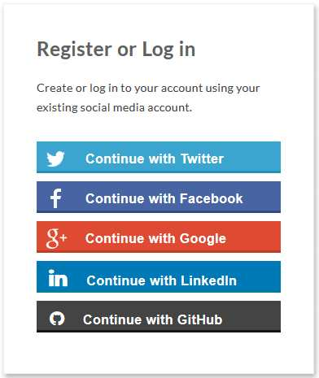

# 概览

- 这组 OAuth 系列教程，第一篇介绍了基本概念，第二篇介绍了获取令牌的四种方式，今天演示一个实例，如何通过 OAuth 获取 API 数据。

很多网站登录时，允许使用第三方网站的身份，这称为"第三方登录"。



下面就以 GitHub 为例，写一个最简单的应用，演示第三方登录。

## 1 第三方登陆原理

所谓第三方登录，实质就是 OAuth 授权。用户想要登录 A 网站，A 网站让用户提供第三方网站的数据，证明自己的身份。获取第三方网站的身份数据，就需要 OAuth 授权。

举例来说，A 网站允许 GitHub 登录，背后就是下面的流程。

```doc
1. A 网站让用户跳转到 GitHub。
2. GitHub 要求用户登录，然后询问"A 网站要求获得 xx 权限，你是否同意？"
3. 用户同意，GitHub 就会重定向回 A 网站，同时发回一个授权码。
4. A 网站使用授权码，向 GitHub 请求令牌。
5. GitHub 返回令牌.
6. A 网站使用令牌，向 GitHub 请求用户数据。
```

下面就是这个流程的代码实现。

## 2 应用登记

一个应用要求 OAuth 授权，必须先到对方网站登记，让对方知道是谁在请求。

所以，你要先去 GitHub 登记一下。当然，我已经登记过了，你使用我的登记信息也可以，但为了完整走一遍流程，还是建议大家自己登记。这是免费的。

访问[这个网址](https://github.com/settings/applications/new)，填写登记表。

提交表单以后，GitHub 应该会返回客户端 ID（client ID）和客户端密钥（client secret），这就是应用的身份识别码。

## 参考文档

http://www.ruanyifeng.com/blog/2019/04/github-oauth.html